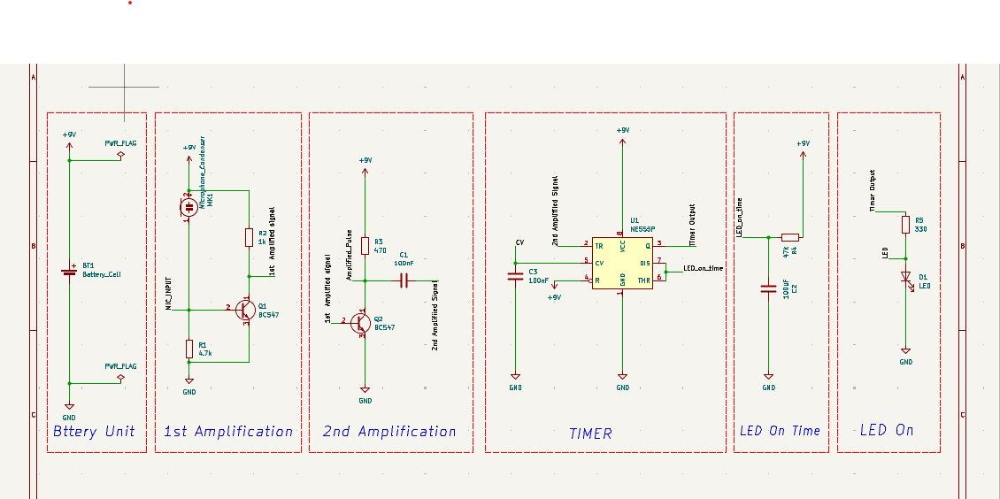
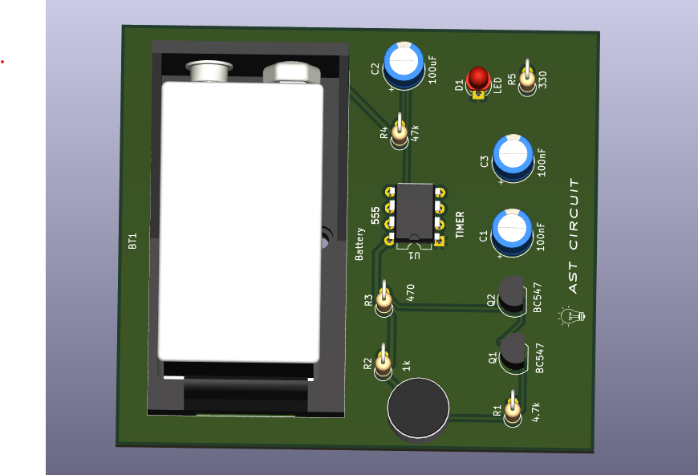
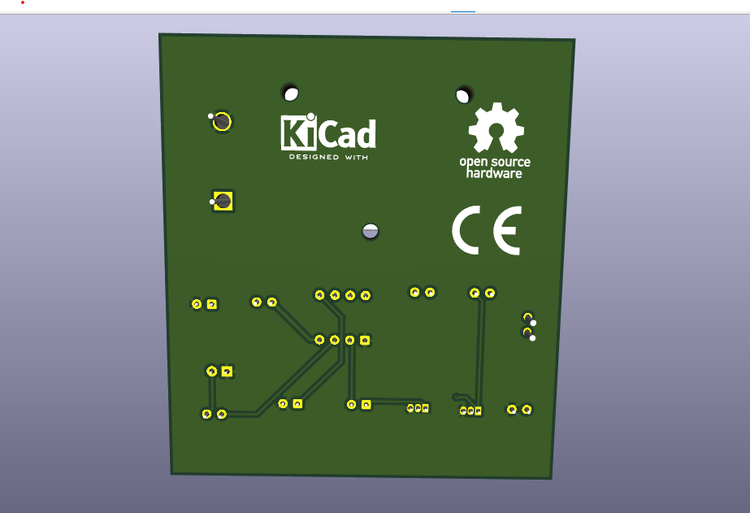
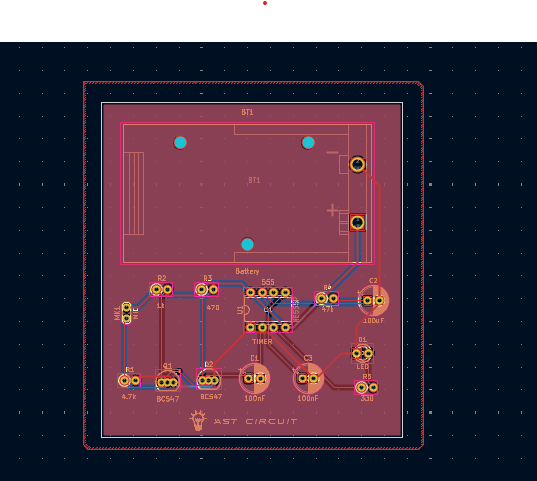

# 👏 Clap Controlled LED Switch (Sound Activated)

This repository contains the schematic, PCB layout, and Gerber files for a **clap-controlled LED project** designed in **KiCad**. It uses a microphone, BC547 transistors, and an NE555 timer in monostable mode to toggle an LED upon detecting a sharp sound like a clap.

A great beginner-to-intermediate level project for learning:
- Audio signal amplification
- Transistor biasing
- Pulse triggering using NE555
- PCB layout and design fundamentals

---

## 🛠️ Project Overview

This circuit listens for a **clap or tap sound**, amplifies the microphone signal using two NPN transistors, and triggers a **NE555 timer** to turn ON an LED for a few seconds.

### 🔍 Features:
- Microphone-based sound detection
- 2-stage BC547 transistor amplifier
- NE555 timer in monostable configuration
- Adjustable LED ON duration
- Powered by 9V battery
- Clean, compact PCB layout
- Custom silkscreen for readability

---

## ⚡ Circuit Diagram

---

## 🧾 Components Used

| Component      | Value / Part No. | Quantity |
|----------------|------------------|----------|
| Condenser Mic  | —                | 1        |
| Resistor       | 1kΩ              | 1        |
| Resistor       | 4.7kΩ            | 1        |
| Resistor       | 470Ω             | 1        |
| Resistor       | 330Ω             | 1        |
| Resistor       | 47kΩ             | 1        |
| Capacitor      | 100nF (C1, C3)   | 2        |
| Capacitor      | 100µF (C2)       | 1        |
| Transistor     | BC547            | 2        |
| IC             | NE555            | 1        |
| LED            | Red              | 1        |
| Battery Clip   | 9V snap          | 1        |
| PCB            | Custom-made      | 1        |

---

## 📐 PCB Layout

### Top View (Component Side)

### Bottom View (Solder Side)

### Copper trace (traces)

---

## 📂 Files Included

- `Clap_controlled_LED.kicad_sch` – Schematic file
- `Clap_controlled_LED.kicad_pcb` – PCB layout file
- `gerber/` – Folder with Gerber files for fabrication
- `schematic.png` – Screenshot of schematic
- `front.png` – 3D render or top view of the PCB
- `back.png` – 3D render or bottom copper layer
- `README.md` – This file

---

## ✍️ Author

**Abhishek Tomar**  
B.Tech Electrical Engineering Student  
Passionate about Embedded Systems, PCB Design, and Practical Electronics

---

## 📜 License

This project is open-source under the **MIT License**.  
Feel free to use, modify, and improve it.

---

## 🚀 Getting Started

1. Clone or download this repository.
2. Open `.kicad_sch` and `.kicad_pcb` in **KiCad**.
3. Review or modify the circuit.
4. Generate Gerber files if needed.
5. Order PCB or build it on breadboard.
6. Solder components as shown in the front image.
7. Power the circuit with 9V — clap or tap near the mic, and watch the LED glow!

---

## 🙋‍♂️ Support

If you liked this project, **give it a ⭐**, share feedback, or suggest improvements via issues or pull requests!

